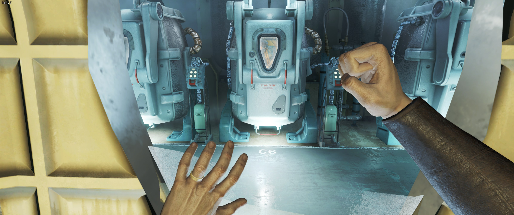
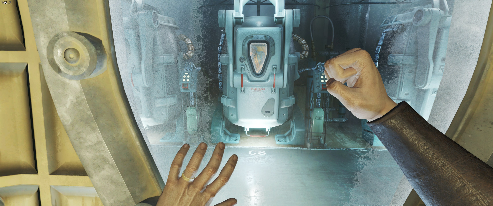
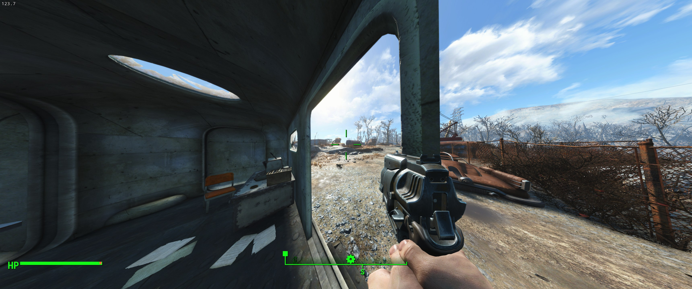
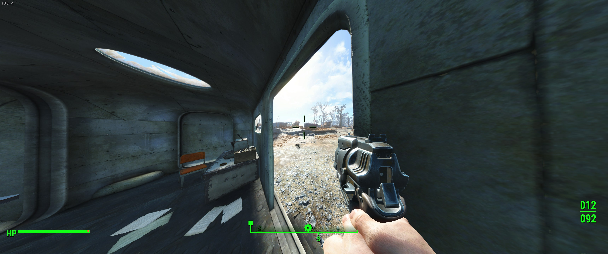

# [Fix Camera Clipping](https://www.nexusmods.com/fallout4/mods/93910)
Fixes the camera clipping through geometry in first-person by adjusting its near distance to account for the field of view.

## Pre-requisites
### Building
- Visual Studio 2026

### Running
- Fallout 4
- [Fallout 4 Script Extender](https://f4se.silverlock.org/)

## Usage
Install Fallout 4 Script Extender and place `FixCameraClipping.dll` in `.\Data\F4SE\Plugins\`.

## Screenshots
### Default FOV @ 3440x1440
#### Before

#### After

### 150 FOV @ 3440x1440
#### Before

#### After

